# ChangeGraph

A regulatory intelligence and deterministic decision engine. ChangeGraph
turns natural-language regulatory text into structured, executable
knowledge, evaluates records against it with a deterministic rule engine,
and traces every decision back to the regulatory source that produced it.
When a regulation changes, it shows exactly what that change touches --
rules, policies, workflows, and historical decisions -- and re-runs
history to show which outcomes would have been different.

> **Synthetic demonstration regulation. Not legal advice.** The seeded
> "Consumer Lending Fairness Regulation" is fictional and was written for
> this proof of concept. Nothing in this repository should be treated as
> real regulatory guidance.

This is a proof-of-concept / portfolio project. It demonstrates a specific
architectural thesis, not a production compliance system -- see
[Limitations](#limitations).

---

## Screenshots

<table>
<tr>
<td width="50%">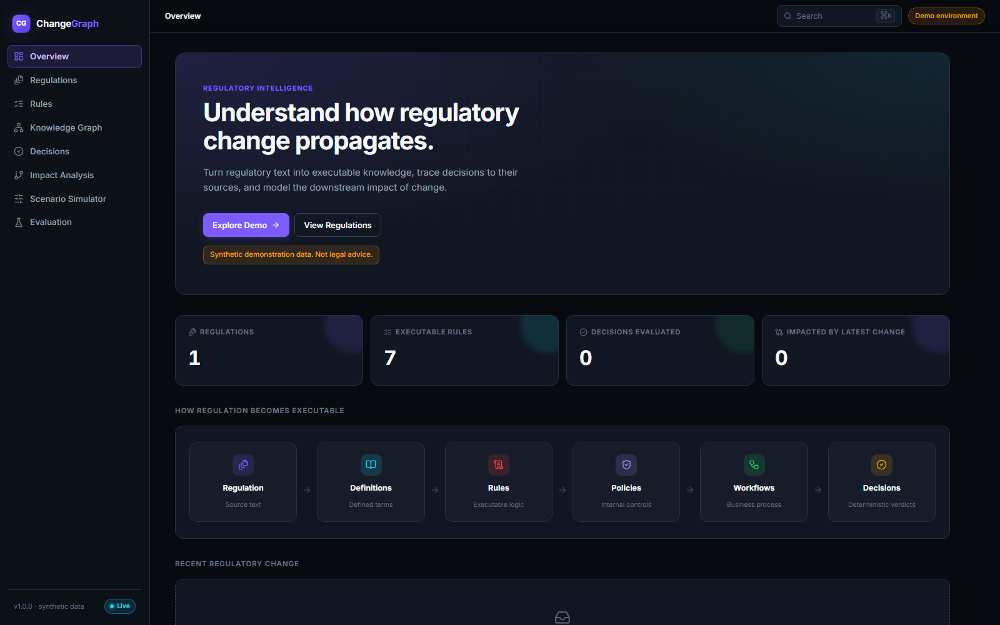<br><sub>Overview dashboard</sub></td>
<td width="50%">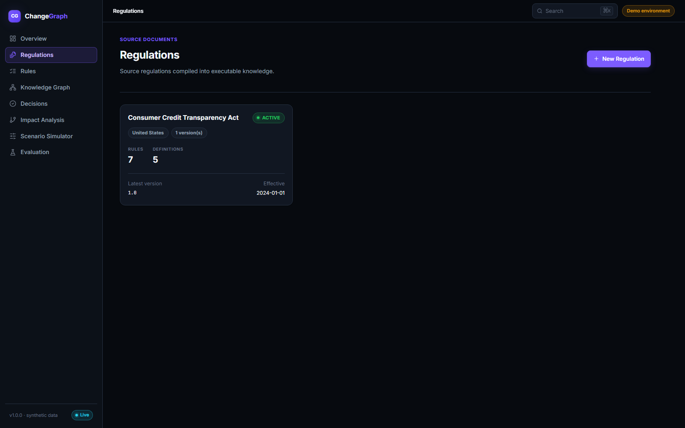<br><sub>Regulations list</sub></td>
</tr>
<tr>
<td>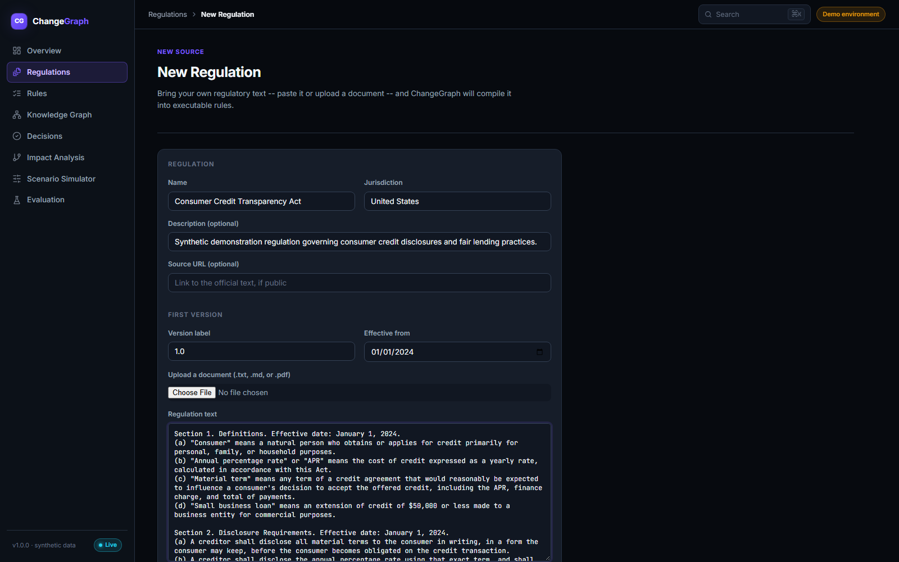<br><sub>Bring-your-own regulation (paste or upload text/PDF)</sub></td>
<td>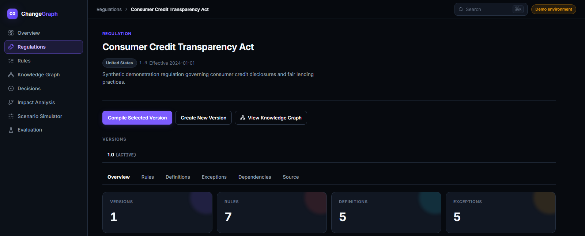<br><sub>Regulation version overview</sub></td>
</tr>
<tr>
<td>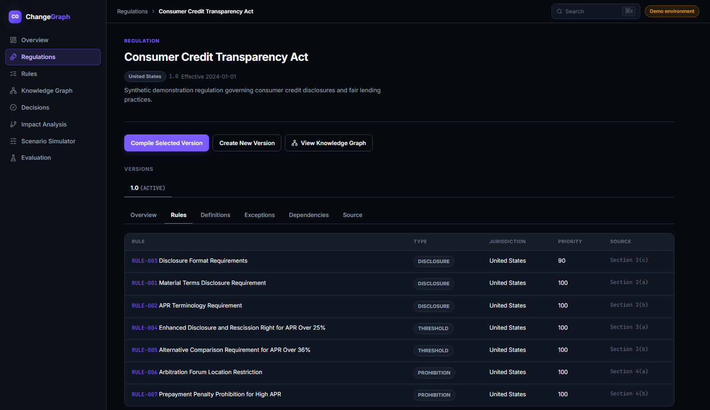<br><sub>Compiled rules</sub></td>
<td>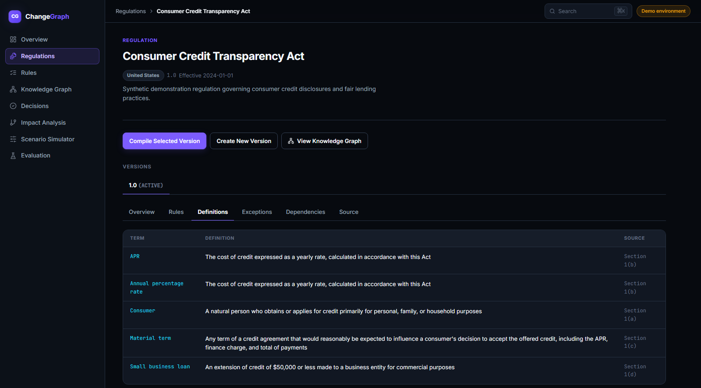<br><sub>Compiled definitions</sub></td>
</tr>
<tr>
<td>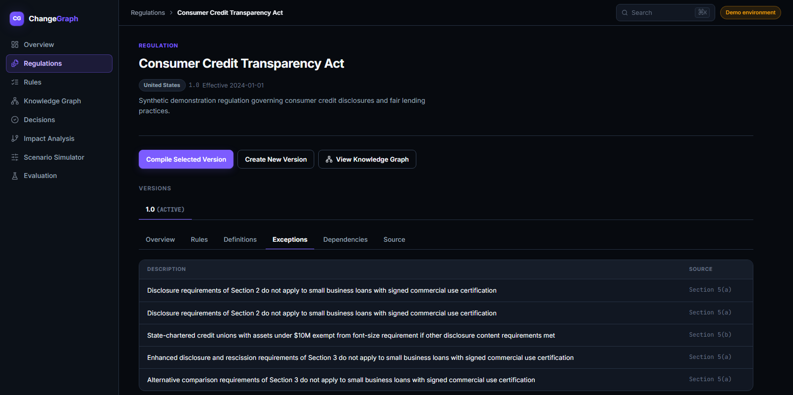<br><sub>Compiled exceptions</sub></td>
<td>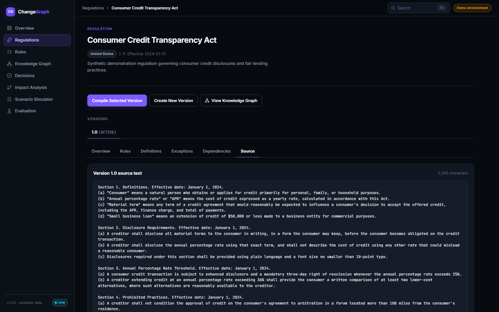<br><sub>Source text the rules were compiled from</sub></td>
</tr>
<tr>
<td>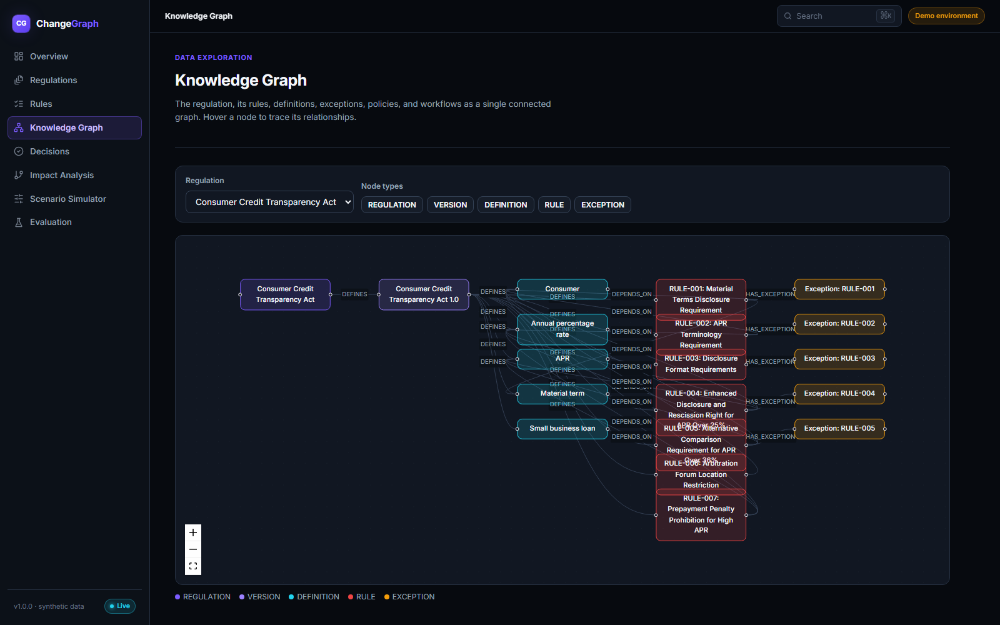<br><sub>Knowledge graph</sub></td>
<td>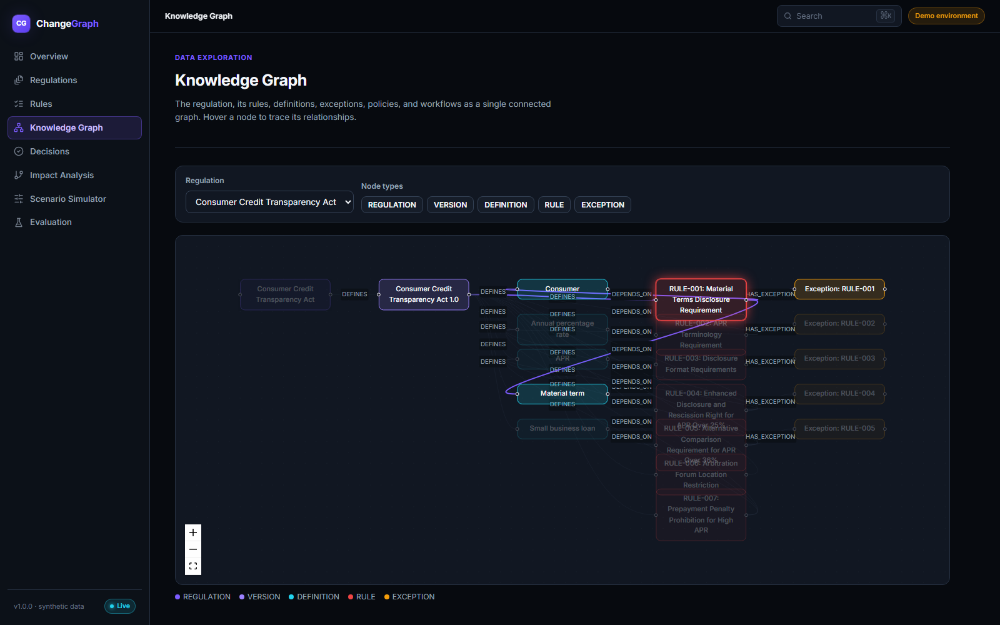<br><sub>Knowledge graph node detail</sub></td>
</tr>
</table>

## What is ChangeGraph?

The central product question is: **"What happens if this regulation
changes?"**

ChangeGraph answers it end to end:

1. Load a regulation's text.
2. Compile it into structured rules, definitions, and exceptions.
3. Evaluate records (loan applications, in the demo) against those rules
   and get a deterministic, explainable verdict.
4. Publish a new version of the regulation (an amendment).
5. Analyze how that change propagates through the knowledge graph --
   which rules, policies, and workflows depend on what changed.
6. Re-run every historical decision that could be affected against the
   new version.
7. Show exactly which decisions changed, and why, down to the specific
   rule and source paragraph responsible.

## Why it exists

Regulatory and policy text is written for humans, but the systems that
enforce it need to run millions of deterministic checks. The naive
approach -- pointing an LLM at each case and asking "is this compliant?"
-- is neither reproducible nor explainable, and it makes auditing
regulatory change effectively impossible. ChangeGraph demonstrates a
cleaner split: use a model to do what models are good at (turning
ambiguous prose into structured data), and use a deterministic engine to
do what deterministic engines are good at (evaluating that structured
data against a case, the same way every time, with a full paper trail).

## Architecture

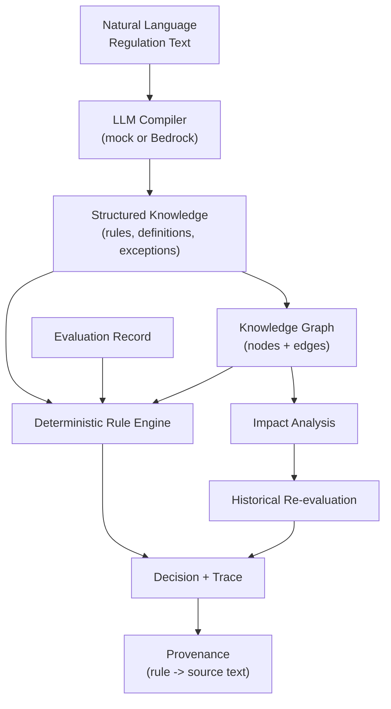

**The learned/probabilistic layer never makes a compliance decision.** It
only ever produces structured data (rules, definitions, exceptions,
relationships) that is validated by Pydantic schemas before it touches the
database or the engine. The deterministic layer -- rule evaluation,
applicability, precedence, decision aggregation, dependency traversal,
impact analysis, historical re-evaluation -- is pure Python with no model
calls anywhere in the path from "record in" to "verdict out." Given the
same record, the same rule version, and the same ontology version, the
system always produces the same decision. See
[app/engine](backend/app/engine) (no I/O, no randomness) versus
[app/compiler](backend/app/compiler) (the only place an LLM is called).

### Backend module layout

```
backend/app/
  models/       SQLAlchemy ORM models (the schema, see below)
  schemas/      Pydantic request/response models (the API boundary)
  api/          FastAPI routers -- thin, no business logic
  services/     Orchestration: DB-aware glue between engine/compiler/graph and the API
  engine/       The deterministic rule engine -- pure functions, no DB, no I/O
  compiler/     LLM provider abstraction + extraction + validation
  graph/        Knowledge graph construction, traversal, impact analysis
  evaluation/   Historical re-evaluation, decision comparison, engine benchmark
  seed/         The demo dataset and the `python -m app.seed` entry point
```

## Data model

Ten entities, described in full in the ER-ish summary below (see
`backend/app/models/` for exact columns):

- **Regulation** -> **RegulationVersion** (1\:N) -- a regulation has many
  versions (`v1.0`, `v2.0`, ...), each with its own source text and
  effective window.
- **Rule** -- belongs to a version; holds `conditions` and `actions` as
  JSONB, the executable payload the engine reads.
- **Definition** -- belongs to a version; a defined term, used for
  provenance and for `DEPENDS_ON` graph edges.
- **RuleException** (spec calls this entity "Exception"; renamed in code
  to avoid shadowing Python's builtin) -- belongs to a Rule; a carve-out
  condition that suppresses the rule when it matches.
- **KnowledgeNode** / **KnowledgeEdge** -- a generalized graph over every
  other entity (`REGULATION`, `VERSION`, `DEFINITION`, `RULE`,
  `EXCEPTION`, `POLICY`, `WORKFLOW`), connected by typed relationships
  (`DEFINES`, `DEPENDS_ON`, `HAS_EXCEPTION`, `IMPLEMENTS`, `REQUIRES`,
  `SUPERSEDES`, `AFFECTS`, ...).
- **Policy**, **Workflow** -- business entities that reference rules
  through graph edges (`POLICY -IMPLEMENTS-> RULE`,
  `WORKFLOW -REQUIRES-> POLICY`).
- **EvaluationRecord** -- an input case (a loan application in the demo).
- **Decision** / **DecisionTrace** -- a verdict and its full explanation:
  one trace row per applicable rule, with the exact condition values,
  the matched exception (if any), and the source paragraph.
- **ImpactAnalysis** / **ImpactItem** -- the result of comparing two
  versions: what changed, what depends on it, and (after re-evaluation)
  which historical decisions flipped.

## The deterministic engine

`backend/app/engine/` has no database access and no network calls --
every function takes plain dicts/dataclasses and returns plain dicts, so
it's trivial to unit test and impossible to make non-reproducible.

- **`operators.py`** -- `equals`, `not_equals`, `greater_than`,
  `greater_than_or_equal`, `less_than`, `less_than_or_equal`, `in`,
  `not_in`, `contains`, `starts_with`, `is_true`, `is_false`, `before`,
  `after`, `between`, `days_since`. No `eval()`, no arbitrary code
  execution -- conditions are JSON, always.
- **`evaluator.py`** -- recursively evaluates `all` / `any` / `not`
  condition trees over dotted field paths (`loan.apr`), returning an
  annotated result tree (field, operator, expected, actual, result) used
  directly as the decision trace.
- **`applicability.py`** -- before a rule's conditions are evaluated at
  all, checks jurisdiction (`ANY` or exact match) and the effective date
  window. A California-only rule never touches a New York record.
- **`decision_service.py`** -- orchestrates a full evaluation: for each
  rule, check applicability, evaluate conditions, check exceptions (an
  exception match always wins and suppresses the rule), and aggregate a
  verdict. **Aggregation is "worst verdict wins"**: `FAIL` outranks
  `REVIEW` outranks `PASS`, computed only over rules that actually fired.
  This is the simplest model that is still correct for a POC (see
  [Design decisions](#design-decisions)) -- rule `priority` is used for
  display ordering and conflict detection, not for suppressing rules.

## LLM / compiler architecture

`backend/app/compiler/llm_provider.py` defines a `Protocol`:

```python
class LLMProvider(Protocol):
    async def generate_structured(self, source_text: str, jurisdiction: str) -> dict: ...
```

Two implementations ship:

- **`MockLLMProvider`** (default, `LLM_PROVIDER=mock`) -- deterministically
  parses the demo regulation's tagged prose (`=== RULE: CODE | Title ===`
  sections with `<<TAG: value>>` annotations -- see
  `backend/app/compiler/regulation_parser.py`) instead of calling a model.
  **The application runs the full demo, including compiling regulation
  text, with zero API keys and zero network access.** The tags are a
  stand-in for what an LLM would infer from the surrounding prose; a real
  provider ignores them entirely.
- **`BedrockProvider`** (`LLM_PROVIDER=bedrock`) -- sends the regulation
  text as a user message with the extraction instructions as a system
  prompt to an Amazon Bedrock model via the `converse` API, and parses the
  JSON it returns (with a fallback that scans for the outermost `{...}`
  block if the model wraps its answer in prose). `boto3` is imported
  lazily and the call runs in a worker thread (`asyncio.to_thread`) so it
  never blocks other requests. This path is exercised against real,
  untagged legal text -- not just the demo's tagged prose -- see
  [Running with Bedrock](#running-with-bedrock).

Either way, raw output goes through `app/compiler/validator.py` (Pydantic
models covering every field, operator validity checked against the
engine's own operator list) before a single row is written. Invalid
entries are dropped and reported as warnings in the compilation report --
one malformed rule does not fail an entire compile. The provider itself
is injected as a FastAPI dependency (`Depends(get_llm_provider)`), so
tests always run against the deterministic mock regardless of what
`LLM_PROVIDER` is set to in the environment they happen to run in.

### Bringing your own regulation

The **Regulations** page has a **+ New Regulation** button
(`/regulations/new`) that does not depend on the seeded demo data at all:
give it a name and jurisdiction, then either paste regulatory text
directly or upload a `.txt`, `.md`, or `.pdf` file (extracted server-side
via `pypdf` at `POST /api/documents/extract-text`, then loaded into the
text box for review before saving -- nothing is compiled from a file
sight-unseen). Saving creates the Regulation and its first Version, and
optionally compiles it immediately through whichever `LLMProvider` is
configured. With `LLM_PROVIDER=bedrock`, this is the intended way to
exercise the compiler against real, arbitrarily-formatted legal text
rather than the demo's tagged prose.

## The change-impact algorithm

1. Load rules/definitions/exceptions for both versions; diff by
   `rule_code` / `term` (added / removed / modified, with a field-level
   diff for modified rules).
2. For every changed or removed rule/definition/exception, find its graph
   node in the **old** version's graph and walk edges **backward**:
   `A --IMPLEMENTS--> B` is read as "A implements B", so if B changes, A
   (the source of the edge) is affected. Reverse-BFS from every changed
   node finds every dependent policy and workflow transitively.
3. Assign severity per node type (`RULE`/`WORKFLOW` -> `HIGH`,
   `POLICY`/`DEFINITION`/`EXCEPTION` -> `MEDIUM`) -- a simple, explicit
   heuristic, not a scoring model.
4. Identify **candidate** historical decisions: any decision made under
   the old version whose trace touched a modified/removed rule, or whose
   record would newly satisfy an added rule's applicability. This is
   `POST /api/impact-analysis`.
5. On `POST /api/impact-analysis/{id}/re-evaluate`, actually re-run each
   candidate through the deterministic engine against the new version,
   store the new `Decision` linked to the old one via
   `changed_from_decision_id`, and record an `ImpactItem` for every
   verdict that changed, with a plain-English reason derived from which
   rules newly fired or stopped firing.

Nothing about the resulting counts (`rules_affected`, `decisions_changed`,
...) is hard-coded -- they fall out of running the real diff and the real
engine over the seeded data.

## Running locally (without Docker)

Requires Python 3.12+, Node 20+, and a local PostgreSQL 16 instance.

```bash
# 1. Database
createdb changegraph   # or: docker run -d -p 5432:5432 -e POSTGRES_USER=changegraph \
                        #     -e POSTGRES_PASSWORD=changegraph -e POSTGRES_DB=changegraph postgres:16-alpine

# 2. Backend
cd backend
python -m venv .venv && . .venv/Scripts/activate   # or source .venv/bin/activate on macOS/Linux
pip install -r requirements.txt
cp ../.env.example .env    # edit DATABASE_URL if needed
alembic upgrade head
python -m app.seed
uvicorn app.main:app --reload

# 3. Frontend (separate terminal)
cd frontend
npm install
npm run dev
```

Open `http://localhost:5173`. The backend is at `http://localhost:8000`,
with interactive API docs at `http://localhost:8000/docs`.

## Running with Docker

```bash
docker compose up --build
```

This starts PostgreSQL, runs migrations, seeds the full demo dataset, and
starts both the API (`:8000`) and the frontend (`:5173`) -- one command,
no configuration, no API key. If any of those ports are already in use on
your machine, override them without editing the compose file:

```bash
POSTGRES_PORT=5433 BACKEND_PORT=8010 FRONTEND_PORT=5183 docker compose up --build
```

## Running with Bedrock

By default `LLM_PROVIDER=mock` and no AWS access is needed. To compile
regulation text with a real model instead, set in `backend/.env` (or the
environment):

```bash
LLM_PROVIDER=bedrock
AWS_REGION=us-east-1
BEDROCK_MODEL_ID=us.anthropic.claude-sonnet-4-5-20250929-v1:0
AWS_ACCESS_KEY_ID=...
AWS_SECRET_ACCESS_KEY=...
```

`boto3` and `pypdf` are both in `requirements.txt` already (they're never
imported unless you actually use the Bedrock path or upload a PDF, so
they don't cost the mock-only path anything). Credentials can also come
from `~/.aws/credentials` or an instance role instead of `.env` -- `boto3`
uses its normal resolution order either way.

**On the model ID:** most current Claude models on Bedrock reject
on-demand invocation by their bare model ID and require the
cross-region inference profile ID instead -- the same model prefixed with
a region code (`us.`, `eu.`, etc). If you see `ValidationException:
Invocation of model ID ... with on-demand throughput isn't supported`,
that's what's happening; run `aws bedrock list-foundation-models` to see
what's enabled for your account, and try the same ID with a `us.` prefix.

This path is tested against real, unmarked legal text through the
**+ New Regulation** flow (paste or upload a `.txt`/`.md`/`.pdf`) -- not
just the seeded demo's tagged prose, which the mock provider is built
around. The seed script (`python -m app.seed`) always uses
`MockLLMProvider` directly regardless of this setting, so the demo
dataset is unaffected and remains free and instant to (re)generate.

## API documentation

FastAPI serves interactive Swagger UI at `/docs` and ReDoc at `/redoc`
whenever the backend is running. The full route list is in
`backend/app/api/`; every request/response shape is a typed Pydantic
schema in `backend/app/schemas/`.

## Frontend design system

The UI is a dark, data-infrastructure-styled interface (`frontend/src/styles.css`
holds the full token set -- backgrounds, accent/status colors, radii,
shadows). Reusable pieces live in `frontend/src/components/`: `Badge`
(verdict/severity/transition pills), `MetricCard`, `RuleBlock` (renders a
rule's conditions/actions as pseudo-code), `Timeline` (the decision-trace
chain), `GraphView` + `GraphNodePanel` (the knowledge graph and its
click-through detail panel), and `SidePanel`. Icons come from
`lucide-react`, the one UI dependency added beyond the original stack, via
a single re-export file (`components/icons.tsx`) so every page pulls from
the same set. No Tailwind, no component-kit dependency -- plain CSS
classes applied consistently.

## Testing

```bash
cd backend
pytest
```

56 tests across:

- **Unit tests** for every comparison operator, `all`/`any`/`not` logic
  (including nesting), exceptions, jurisdiction filtering, effective-date
  windows, and verdict aggregation.
- **Integration tests** driving the full HTTP API: regulation -> compile
  -> rules -> evaluate -> decision -> impact analysis -> re-evaluation.
- **A determinism test**: the same record evaluated 100 times against the
  same rules produces byte-identical trace output every time.
- **Document extraction tests**: plain text, PDF (including the
  no-extractable-text error path), oversized/empty upload rejection.
- **Compiler tests**: section parsing, tag extraction, and validator
  behavior on both well-formed and malformed extraction output.
- **Conflict-detection tests**.

```bash
cd frontend
npm run build   # tsc --noEmit + vite build; fails on type errors
```

## Design decisions

- **"Worst verdict wins," not a full precedence engine.** A rule fires or
  it doesn't; if it fires, its verdict (`PASS`/`REVIEW`/`FAIL`) is
  aggregated by taking the worst outcome across every rule that fired.
  Exceptions are the one thing that can suppress a rule outright. This is
  deliberately simpler than a full legal-precedence resolver (the prompt
  for this project explicitly warns against building one) while still
  producing correct, explainable results for every rule in the demo
  dataset -- including a rule pair (`RULE-017` / `RULE-042`) that a naive
  static conflict scanner flags as a potential overlap even though the
  exception on `RULE-017` correctly routes military borrowers to
  `RULE-042` instead. That's intentional: the conflict detector is a
  heuristic aid for a human reviewer, not a proof of correctness.
- **`clock_timestamp()`, not `now()`, for `created_at`/`evaluated_at`
  server defaults.** PostgreSQL's `now()` is constant for the whole
  transaction it's called in. The seed script inserts hundreds of rows
  (two versions, 162 records, 300+ decisions) inside one transaction; with
  `now()` every one of them would get an identical timestamp, making
  "most recent version" or "most recent decision" queries return rows in
  an arbitrary order. `clock_timestamp()` returns the actual wall-clock
  time at each call.
- **The regulation compiler round-trips through tagged prose.** Rather
  than hard-coding the demo's rules directly into the database, the seed
  script renders them into realistic (but tag-annotated) regulatory text
  and runs it through the real compiler pipeline -- the same code path a
  user hits from the UI. This means the seed script is itself a
  demonstration of the compile step, not a shortcut around it.
- **Graph nodes for `Decision`/`Record` are synthesized on demand, not
  persisted.** Persisting a graph node for every historical decision
  would mean thousands of nodes/edges for a dataset this size, with no
  benefit -- the "impact graph" endpoint only needs to show the decisions
  that actually changed, which is a small, bounded set it can construct
  from `ImpactItem` rows at request time.
- **A modular monolith.** No message queue, no microservices, no vector
  database, no Neo4j -- PostgreSQL with a real relational + JSONB schema
  is sufficient for this scale and keeps the system easy to run and
  understand end to end.

## Limitations

- The demo regulation is entirely fictional; the mock compiler's
  tag-annotated prose format is a stand-in for a real LLM's extraction
  and would not work unmodified against arbitrary real-world regulatory
  text (a real LLM provider is not subject to this restriction).
- Rule precedence is intentionally simple (see above) -- it does not model
  legal doctrines like implied repeal, field preemption, or explicit
  rule-vs-rule precedence declarations.
- Conflict detection is a heuristic over numeric thresholds on shared
  fields; it does not understand semantic equivalence between differently
  worded conditions.
- No authentication, multi-tenancy, or audit log of *who* made a change --
  out of scope for this proof of concept.
- The synthetic dataset's record generator uses a fixed RNG seed for
  reproducibility; it is not representative of any real loan portfolio.
- The compiler sends a regulation version's entire source text to the LLM
  in a single call. Very large real-world documents (hundreds of thousands
  of characters -- e.g. the full text of a lengthy federal regulation) can
  exceed the model's context window, and compilation fails with a clear
  "input is too long" error rather than silently truncating. Chunking a
  large document into sections and compiling/merging them would be the
  natural next step, but is not implemented here.

## Future work

- A real Bedrock (or other-provider) extraction pass over genuine public
  regulatory text, with a human review/approval step before compiled
  rules go live.
- Rule-level unit testing UI (attach specific test cases to a rule
  directly, beyond the global benchmark suite).
- A proper precedence/override declaration on rules (e.g. "RULE-042
  overrides RULE-017 when both apply") instead of relying entirely on
  exceptions.
- Multi-jurisdiction rule composition (e.g. federal floor + state
  ceiling) as a first-class concept rather than independent rules.
